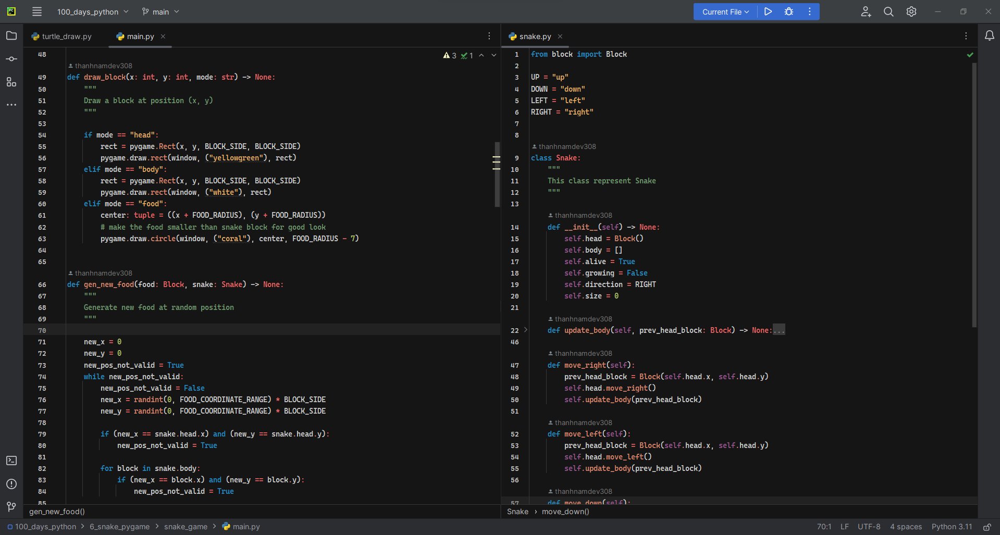

# spirited-away-pycharm-theme
Spirited away coding theme for Pycharm IDE

This is my edit for spirited-away theme for vscode so that it can be used for IntelliJ-based IDEs, such as IntelliJ IDEA, WebStorm, and PyCharm.

Preview:

Source theme:
[Spirited Away Color Theme](https://github.com/maxfie1d/vscode-color-theme-spirited-away/blob/master/README.md) from [maxfie1d](https://github.com/maxfie1d)

Tool for conversion:
[colorSchemeTool for JetBrains IDEs](https://github.com/JetBrains/colorSchemeTool) (run on Python 2.7)